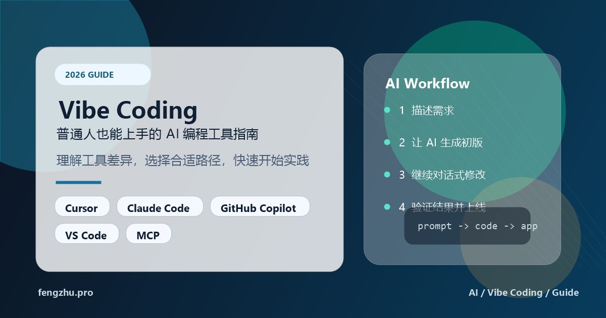
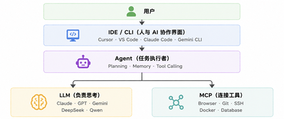
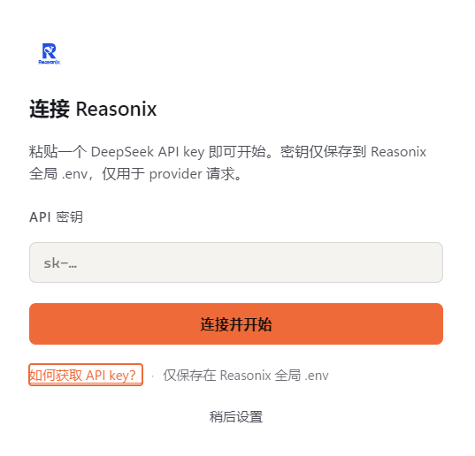
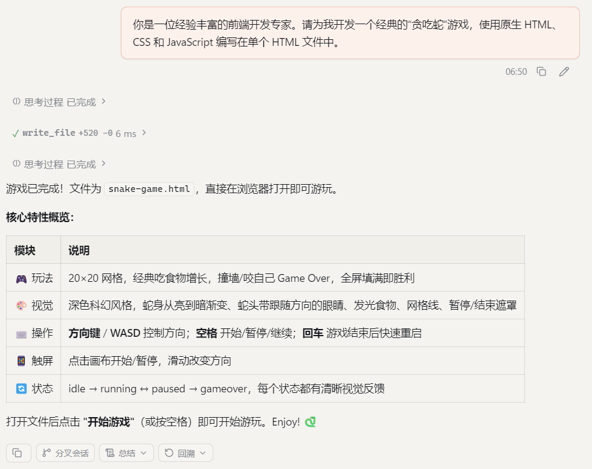
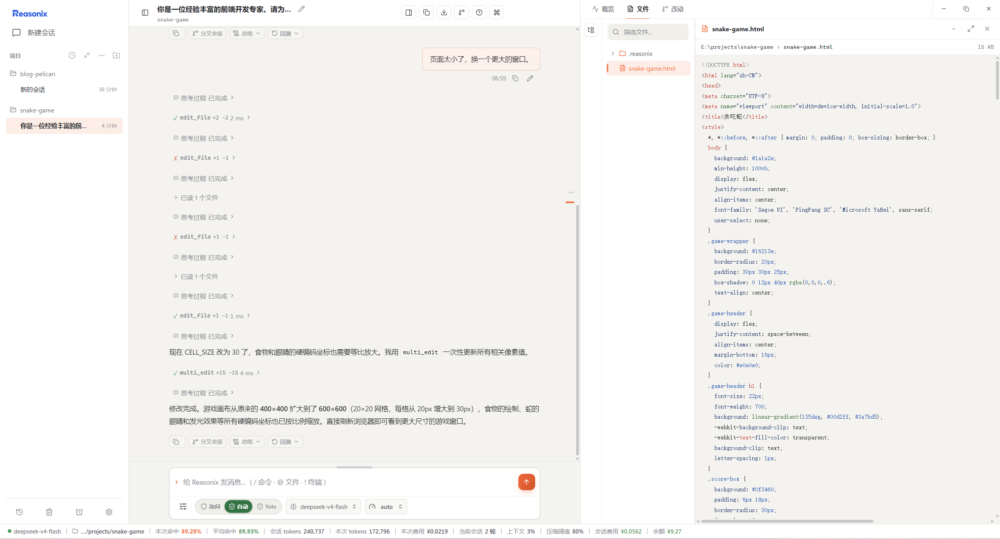

[toc]

> AI 正在改变软件开发，但 Vibe Coding 并不只是程序员的专属能力。

过去，软件开发最大的成本之一，是把自己的想法转换成代码。而现在，这个转换过程正在被 AI 大幅缩短。

你的角色，也逐渐从"代码编写者"转变为：

- 提出目标的人
- 拆解需求的人
- 判断结果的人
- 持续优化的人

代码仍然重要，但它不再是人与计算机沟通的唯一语言。未来，越来越多的人可能不会成为专业程序员，却能够借助 AI，把自己的创意变成真正可以运行的软件。这正是 Vibe Coding 最值得关注的地方。

这篇文章并不是简单列举工具排行榜，而是帮助普通用户回答四个问题：

1. 什么是 Vibe Coding？
2. 为什么越来越多人开始使用它？
3. Vibe Coding是怎么工作的？
4. 我应该选择什么工具？
5. 我应该怎样开始使用？

# 第一章：什么是 Vibe Coding？

过去几十年，学习软件开发几乎都遵循同一条路径：学习编程语言 → 学习框架 → 写代码 → 调试 → 发布。

无论是 C、Java、Python，还是 JavaScript，本质上都是由人亲自完成每一行代码。而今天，AI 正在改变这一过程。越来越多的人发现，他们不一定需要亲自编写所有代码，而是可以告诉 AI 自己想要什么，让 AI 完成大部分实现工作。

## 从「写代码」到「描述需求」

假设你想开发一个天气查询网页。以前，你可能需要完成下面这些工作：

1. 学习 HTML 和 CSS
2. 学习 JavaScript
3. 查阅天气 API 文档
4. 编写网络请求代码
5. 设计页面布局
6. 调试各种报错
7. 发布到服务器

整个过程可能需要几天甚至几周。而现在，你可以直接告诉 AI：

```
帮我开发一个天气查询网页。
输入城市名称后，可以显示未来 7 天天气。
页面尽量简洁，支持手机浏览。
```

几秒钟后，AI 就会生成一个可以运行的版本。

如果你觉得页面不好看，可以继续说：

```
换成蓝色主题。
增加空气质量显示。
```

AI 会继续修改代码，直到满足你的需求。你不再需要从零开始写每一行代码，而是像与一位经验丰富的程序员沟通一样，不断完善你的想法。这种开发方式，正在逐渐成为新的工作模式。

## Vibe Coding 到底是什么？

Vibe Coding 并不是一种新的编程语言，也不是某一款软件，而是一种人与 AI 协同开发的新方式。你负责提出需求、做出判断和不断优化，AI 则负责生成代码、执行任务和完成大量重复工作。

很多人第一次听到这个词时，会产生两个误解。

### 误解一：不会编程也能一句话做出 APP

很多短视频喜欢展示这样的画面：

**「一句 Prompt，5 分钟开发一个 APP。」**

现实并没有这么简单。AI 的确可以快速生成代码，但真正的软件开发仍然需要不断修改、测试、优化和迭代。如果需求不够清晰，AI 同样可能理解错误。因此，Vibe Coding 并不是一句话完成所有工作，而是 **通过不断交流，让 AI 逐步完成开发任务** 。

### 误解二：程序员以后不用写代码了

另一些人则认为：

> AI 都能写代码了，程序员是不是要失业了？

事实上，大多数情况下，AI 更像是一位能力很强的助手。它可以：

* 编写代码
* 修改代码
* 查找 Bug
* 编写测试
* 优化性能
* 阅读项目

但真正决定**做什么、为什么这样做、是否符合需求**的人，依然是开发者。

换句话说：**AI 负责执行，人负责决策。**这也是目前几乎所有主流 AI 编程工具的发展方向。

## 为什么叫 "Vibe Coding"？

"Vibe" 原本有**氛围、感觉、节奏**的意思。在 AI 编程领域，它更强调一种新的协作方式：你不需要事先想好所有代码细节，而是先提出目标，然后根据 AI 的反馈不断调整。

整个开发过程更像是在不断"对话"：

```
用户："帮我做一个博客网站。"
AI："已经完成首页。"

用户："导航栏太复杂，简单一点。"
AI："已经修改。"

用户："增加深色模式。"
AI："已完成。"
```

这种"边交流、边开发、边调整"的过程，就是很多人所说的  **Vibe Coding** 。它更接近与一位同事协作，而不是单纯使用一个代码生成工具。

## Vibe Coding 并不是不需要编程技术

很多文章喜欢把 Vibe Coding 描述成：**零基础也能开发软件。**

这种说法容易让人产生误解。事实上，编程知识依然很有价值。了解一点 Python、HTML 或 JavaScript，可以帮助你：

* 更容易理解 AI 生成的代码
* 更容易发现错误
* 更容易修改功能
* 更容易描述需求

但与过去相比，一个明显的变化是：**你不需要先学会所有知识，才能开始动手。** 以前的学习路径通常是：
学习三个月 → 写第一个项目。现在则更像是：今天开始做项目 → 遇到问题再学习相关知识。**学习和实践第一次真正融合在了一起。**

## 哪些人适合使用 Vibe Coding？

很多人看到"AI 编程"四个字，就觉得这是程序员的事情。其实，受益最大的反而可能是那些**不是职业程序员**的人。

例如：

### 学生

可以让 AI 帮助完成课程项目、数据分析、小工具开发，同时学习编程思路，而不是只会复制代码。

### 教师

制作课堂演示网页、自动批改脚本、教学工具，降低技术门槛，把更多时间放在教学设计上。

### 科研人员

快速编写数据处理脚本、绘图程序、实验分析流程，把重复性的编程工作交给 AI，提高科研效率。

### 产品经理和运营人员

制作原型页面、自动化工具、数据报表，不必等待开发排期，就能快速验证想法。

### 办公人员

利用 Python 和 AI 编写脚本，实现 Excel 自动处理、批量文件整理、日报生成等日常办公自动化。

### 独立开发者

更快完成网站、小程序、个人产品和副业项目，把精力集中在创意和产品本身，而不是重复编写基础代码。

# 第二章：Vibe Coding 为什么突然火了？

如果你过去几年一直关注 AI，你可能会发现一个有趣的现象。
2022 年，ChatGPT 横空出世。
2023 年，越来越多的人开始用 AI 写代码。
但真正让 **Vibe Coding** 成为开发者社区热门话题，却是近两年的事情。为什么不是更早？原因并不是某一个工具突然变得特别厉害，而是 **几项关键技术在同一时期逐渐成熟，并相互促进** 。

## AI 开始真正理解代码

最早的 AI 编程工具，更像是一个"高级自动补全"。AI 可以帮你补全下一行。或者根据注释生成几十行代码。虽然很方便，但本质上仍然是：**人在写代码，AI 在补代码。** 真正的变化来自新一代大语言模型。
如今的 Claude、GPT、Gemini、DeepSeek、Qwen 等模型，不仅能理解单个函数，还能理解整个项目的结构、业务逻辑以及不同文件之间的关系。

例如，你可以直接告诉 AI：

```
> 帮我把整个项目升级到最新版本。

或者：

> 把所有数据库操作改成异步。
```

AI 会分析整个代码仓库，而不是只关注当前这一行代码。这意味着，AI 的角色已经从"代码补全工具"逐渐演变为"开发助手"。

## AI 从聊天变成了 Agent（智能体）

过去，大多数 AI 都停留在聊天窗口中。你问一句，它回答一句。如果需要修改代码，你通常要经历这样的流程：

1. 在聊天窗口提出问题
2. 复制 AI 返回的代码
3. 回到编辑器粘贴
4. 运行程序
5. 出现报错
6. 再复制报错信息回到聊天窗口

整个过程来回切换，非常繁琐。如今，越来越多的 AI 工具开始采用Agent的工作方式。Agent 不只是回答问题，还能够主动完成一系列任务，例如：

* 阅读整个项目
* 修改多个文件
* 运行程序
* 执行测试
* 修复错误
* 重复尝试直到成功

开发者只需要提出目标：

```
> 给这个网站增加用户登录功能。
```

Agent 就会自动规划步骤、修改代码、运行测试，并根据结果继续调整。这种从"回答问题"到"完成任务"的转变，是 Vibe Coding 快速发展的重要原因。

## AI IDE 的出现

如果说大模型提供了"大脑"，那么 AI IDE 就提供了一个真正适合协作的工作环境。过去，开发者通常需要：

* 一个编辑器
* 一个聊天窗口
* 一个终端
* 一个浏览器

多个窗口之间来回切换。如今，以 Cursor、Trae、Reasonix、Windsurf 等为代表的新一代 AI IDE，将这些能力整合到了同一个工作界面。

你可以直接在编辑器中：

* 与 AI 对话
* 修改代码
* 查看差异
* 自动运行程序
* 调试错误
* 管理整个项目

人与 AI 的协作因此变得更加自然，也更高效。

## 越来越多优秀模型可供选择

过去，很多 AI 工具只能使用单一模型。如今，开发者可以根据自己的需求灵活切换不同模型。例如：


| 模型     | 特点                       | 更适合什么场景         |
| ---------- | ---------------------------- | ------------------------ |
| Claude   | 擅长复杂代码理解和长上下文 | 大型项目开发、代码重构 |
| GPT      | 综合能力均衡               | 通用开发、学习、办公   |
| Gemini   | 与 Google 生态结合紧密     | 文档处理、Web 开发     |
| DeepSeek | 推理能力强、成本较低       | 日常开发、科研、算法   |
| Qwen     | 中文能力优秀，开源生态活跃 | 中文开发、本地部署     |

这意味着，我们不再依赖某一家公司的 AI，而是可以根据项目特点自由选择合适的模型。对于普通用户来说，这种竞争也带来了更好的体验和更低的使用成本。

# 第三章：理解整个 Vibe Coding 生态

对于刚接触 AI 编程的人来说，最大的困惑往往不是不会用，而是：**为什么工具这么多？**

网上每天都会出现新的名字：

* Cursor
* GitHub Copilot
* Claude Code
* Gemini CLI
* Trae
* Windsurf
* Continue
* OpenCode
* MCP
* Aider
* Codex CLI
* ...

很多人会忍不住想：我是不是每一个都要学？答案当然是否定的。事实上，这些工具大多数 **并不是竞争关系，而是位于不同的层次，各自承担不同的职责** 。如果把整个 Vibe Coding 看作一家软件公司，那么每一层都像不同的部门。理解了这一点，你就不会再被各种新工具弄得眼花缭乱。

## 整个生态可以分为四层



整套系统中：

- LLM 提供智能；
- MCP 提供工具；
- Agent 负责组织和调度；
- IDE 或 CLI 是人与 Agent 沟通的入口。

可以把 Agent 理解成一位项目经理。它自己不会"思考"，也不会真正"动手"，但它知道什么时候应该请专家思考，什么时候应该调用工具执行。

## IDE / CLI：人与 AI 的工作界面

首先看到的是最外层。也就是我们每天真正接触的软件。例如：

**IDE（图形界面）**

* Cursor
* VS Code + GitHub Copilot
* Trae
* Windsurf
* Continue

**CLI（命令行）**

* Claude Code
* Gemini CLI
* Codex CLI
* Aider
* OpenCode

它们最大的作用其实只有一个：**让人与 Agent 更方便地协作。**
例如你输入：帮我增加登录功能。或者： 修复这个 Bug。IDE 或 CLI 会把你的需求交给 Agent。真正开始工作的，并不是编辑器，而是下面这一层。

## Agent：整个系统的"项目经理"

很多文章都会把 Agent 翻译成"智能体"。但对于普通用户来说，把它理解成：**项目经理**会更容易。

Agent 最重要的工作不是生成代码。而是：

* 理解目标
* 制定计划
* 拆解任务
* 决定下一步
* 调用各种能力
* 不断检查结果
* 直到任务完成

例如你说：

> 为我的博客增加用户登录功能。

Agent 不会立刻开始写代码。它通常会经历类似这样的过程：

```
理解需求
↓
分析项目
↓
制定开发计划
↓
调用 LLM 思考
↓
调用工具修改代码
↓
运行程序
↓
发现错误
↓
再次调用 LLM 分析
↓
继续修改
↓
测试成功
```

整个过程中，它就像一位项目经理，不断协调不同的"成员"完成工作。这也是为什么如今很多 AI 编程工具都开始强调  **Agent 模式** 。因为真正让 AI 变得强大的，并不是回答问题，而是能够持续完成一项复杂任务。

## LLM：Agent 的"大脑"

Agent 自己其实并不会思考。真正负责推理和生成代码的是大语言模型（Large Language Model，LLM）。

例如：

* Claude
* GPT
* Gemini
* DeepSeek
* Qwen

当 Agent 遇到问题时，它会向模型发起请求。例如：请分析这个 Bug。模型负责：

* 阅读代码
* 理解需求
* 推理
* 写代码
* 回答问题

但它本身并不会真正操作你的电脑。例如，它不能直接：

* 打开浏览器；
* 提交 Git；
* 删除文件；
* 运行测试；
* 登录服务器。

因此，可以把 LLM 理解成： **AI 的大脑。**它负责思考，但不会亲自动手。

### 为什么同一个模型，在不同工具里的表现差异很大？

很多人会发现一个有趣的现象：同样都是 Claude Sonnet，在网页聊天里只是一个聊天机器人，但到了 Claude Code 或 Cursor 中，却可以完成整个项目。

原因并不是模型突然变聪明了。真正发生变化的是Agent 开始不断调用同一个模型。
例如，

1. 第一次：请分析项目。
2. 第二次：请修改代码。
3. 第三次：请分析报错。
4. 第四次：请优化方案。

一次完整开发过程中，Agent 可能会调用几十次甚至上百次 LLM。因此，我们真正使用的，其实是：**Agent + LLM**，而不是单独的 LLM。

## MCP：Agent 的"工具箱"

只有会思考还不够。Agent 还需要能够真正操作电脑。这就是 MCP（Model Context Protocol）的作用。
很多人第一次听到 MCP，会误以为它是一种 AI。其实不是。MCP 更准确地说，是一种 **标准协议** 。它定义了一套统一的方法，让 AI 可以安全地连接各种工具。例如：

* Git
* 浏览器
* Docker
* SSH
* 数据库
* Figma
* Notion
* Slack

可以把 MCP 想象成：**电脑上的 USB 接口。** USB 本身不会打印文件，也不会播放音乐。它只是提供了一套统一标准，让不同设备能够连接电脑。MCP 的作用也是如此。它让不同模型、不同工具之间，可以用同一种方式进行通信。

## 一个完整的开发过程

理解了上面的概念，再来看一个例子就非常容易。
假设你说：

> 帮我开发一个个人博客。

整个流程可能是这样的：

```
用户
↓
Cursor
↓
Agent
↓
LLM：设计博客结构
↓
MCP：创建项目文件
↓
LLM：编写首页代码
↓
MCP：写入文件
↓
MCP：启动开发服务器
↓
MCP：打开浏览器测试
↓
发现错误
↓
LLM：分析错误原因
↓
MCP：修改代码
↓
再次测试
↓
直到成功
```

整个过程中：

* **LLM** 负责思考；
* **MCP** 负责执行；
* **Agent** 负责协调；
* **IDE** 负责与你沟通。

四者缺一不可。

## 为什么市面上会有这么多工具？

理解整个架构之后，就很容易明白：为什么 Cursor、Claude Code、GitHub Copilot、Trae、Reasonix 看起来都很像，却又各不相同。

因为它们的区别，往往并不是"有没有 AI"，而是：

* 是否拥有优秀的 Agent；
* 是否支持更多模型；
* 是否集成了 MCP；
* 是否提供了更好的开发体验；
* 是否更适合某类用户。

例如：

* **Claude** 是模型；
* **Cursor** 是 AI IDE；
* **Claude Code** 是 CLI 工具，同时内置了强大的 Agent；
* **GitHub Copilot** 最初以代码补全见长，如今也逐渐加入 Agent 能力；
* **MCP** 则是让这些工具连接 Git、浏览器、数据库等外部世界的标准协议。

因此，它们之间更多是 **协作关系** ，而不是简单的替代关系。

# 第四章：普通用户如何选择工具?

如果你刚开始接触 AI 编程，很容易掉进一个误区，花大量时间研究：

* 哪个模型最强？
* 要不要本地部署？
* MCP 怎么配置？
* 多 Agent 怎么协作？
* 哪个排行榜第一？

结果折腾了一个星期，**一个项目都还没有开始。** 事实上，大多数人真正需要的，只是一套能够帮助自己完成工作的工具。对于普通用户来说， **先开始使用，比先研究工具更重要。** 等真正做过几个项目之后，你自然会知道什么时候需要更换工具、升级模型，或者学习 MCP。

## 新手：先体验 Vibe Coding，而不是研究配置

如果你几乎没有编程经验，只是希望借助 AI 提高工作效率，例如：

* 自动处理 Excel；
* 编写简单的 Python 脚本；
* 制作个人网站；
* 开发一些生活或工作中的小工具；

那么建议先选择**开箱即用**的 AI IDE。我比较推荐[TRAE](https://www.trae.cn/) 或 [Reasonix](https://reasonix.io/)。这两款工具都能让你快速体验 Vibe Coding，而不用花大量时间配置开发环境。

### TRAE

Trae 提供**国内版**和**国际版**两个版本。对于大多数国内用户来说，更建议先尝试国内版。

国内版的优势包括：

* 可以直接使用，无需额外配置国际服务；
* 内置多种国产大模型，例如 DeepSeek；
* 所有模型都免费，适合学习和体验；
* 安装简单，上手速度快。

不过国内版的不足在于：

- 虽然模型都是免费的，但是调用模型需要排队，整体体验感不是很好。

如果以后希望体验 Claude、GPT、Gemini 等国际模型，再考虑国际版即可。国际版支持更多海外模型，但需要能够访问外网，同时采用订阅制，每月15$，更适合已经有一定使用经验的用户。

### Reasonix

优点：

- [Reasonix](https://reasonix.io/) 同样是一款面向普通用户的 AI IDE。它最大的特点是界面简洁、配置较少，能够帮助用户快速进入 AI 编程的工作流。
- 不需要访问外网
- 极高的缓存命中率：Reasonix 通过特殊的缓存机制，可以让 API 调用的缓存命中率高达 90% 以上。而 DeepSeek 的缓存命中价格只有未命中价格的 1/50。这意味着同样的工作，使用 Reasonix 产生的 API 费用可能只有直接调用 API 的 20% 左右。
- DeepSeek V4 在推理方面性能很不错。原来V3跟GPT等国外大模型有差距，现在在编程方面的差距在缩小。
- 总体用下来，体验感会更好，而且调用DeepSeek价格也非常便宜。具体请看[Deepseek 官网价格](https://api-docs.deepseek.com/zh-cn/quick_start/pricing)。

缺点在于：

* 只能调用deepseek模型，需要冲值获得deepseek的key才行。

如果你只是想体验："告诉 AI 自己想做什么，然后一步步完成项目"。 Reasonix 是一个不错的起点。对于新手来说，这个阶段最重要的不是模型有多强，而是：**尽快完成自己的第一个项目。**

## 轻度开发者：选择一款能够长期使用的 AI IDE

如果你已经：

* 会一点 Python；
* 做过数据分析；
* 写过网页；
* 偶尔开发一些脚本或小工具；

那么建议选择一款能够长期使用的 AI IDE。这里我比较推荐Copilot。

### GitHub Copilot

如果你一直使用 VS Code，那么 GitHub Copilot 是升级成本最低的选择。它与 VS Code 集成非常成熟，不需要改变原来的开发习惯。

优点：

* 学习成本低；
* 自动补全体验优秀；
* 与 GitHub 生态结合紧密；
* 每月约 10 美元，价格相对较低。具体请看[Github Copilot 官网价格](https://github.com/features/copilot/plans)。

不足之处是：

- 虽然 Copilot 已经支持 Agent 功能，但在大型项目理解、复杂任务规划和自主执行能力方面，整体体验仍然略逊于 Cursor 和 Claude Code。
- 需要能访问外网。

因此，它更适合：

* 日常开发；
* Python 脚本；
* 数据分析；
* 中小型项目。

## 重度开发者：让 AI 成为真正的开发伙伴

如果 AI 已经成为你每天工作的核心工具，例如：

- 每天开发项目；
- 独立开发产品；
- 长期维护大型代码仓库；
- 团队协作开发；

那么建议直接选择目前最成熟的组合：Cursor + Claude Code。这是目前很多专业开发者都在采用的工作方式。

### Cursor

相比 Copilot，它最大的优势在于：

* 更成熟的 Agent 能力；
* 更强的项目级理解能力；
* 更好的代码重构体验；
* 更适合长期开发。

缺点：

- 学习成本略高一点，但对于需要经常开发项目的人来说，通常很快就能体会到效率提升。
- 不仅需要能访问外网，还要有国外手机号验证。可以通过全局模式下使用国内手机注册，不过后面不一定行。
- 价格有点贵，20$每月。具体请看[Cursor官网价格](https://cursor.com/pricing)。

### Claude Code

Claude Code 更擅长：

- 理解整个项目；
- 拆解复杂任务；
- 修改多个文件；
- 自动运行测试；
- 修复 Bug；
- 与 Git、终端等工具协同工作。

不足：

- 每月22$，按年付18$每月。具体看[Claude官网价格](https://claude.com/pricing)。
- 需要访问外网，不需要国外手机号码验证。

两者结合，既能兼顾日常开发体验，又能充分发挥 Agent 的能力。随着项目越来越复杂，再逐步引入 MCP、自动化工作流等高级功能即可。

# 第五章：10 分钟开始你的第一次 Vibe Coding

读到这里，相信你已经了解了什么是 Vibe Coding，也知道了各种工具之间的区别。但是，如果一直停留在"了解"阶段，你仍然不会真正感受到 AI 编程的魅力。所以，这一章我们不再介绍概念，而是一起完成一个真正的小项目。整个过程非常简单。即使你从来没有写过代码，也可以跟着完成。

## Step 1：安装 Reasonix

首先，前往 [Reasonix官网](https://reasonix.io/) 下载安装程序。安装过程与普通软件基本一致，一路点击"下一步"即可。安装完成后，启动 Reasonix。

## Step 2：配置key



第一次打开时会跳出一个窗口，让你粘贴一个DeepSeek API key。这个key是你调用 DeepSeek 模型 API 的“身份凭证 + 计费钥匙”，没有它，你就不能通过程序或工具使用 DeepSeek 的模型。会报`Authentication failed (HTTP 401): your API key is missing or unset. Add it to .env or run reasonix setup. (DEEPSEEK_API_KEY)`错误。

最好一开始就输入密钥，而不是稍后设置。Reasonix的设置有点bug，在本次尝试中点击设置没有反应，而需要手动配置，有点麻烦。windows系统需要在 `%AppData%\reasonix\` 目录下，创建一个`.env`文件保存key。具体如下：

```
DEEPSEEK_API_KEY=sk-xx # 输入你自己的key
```

如果想免费使用，可以参考[Reasonix + DeepSeek + Opencode 最省钱姿势](https://global.v2ex.co/t/1224540#reply0)。 不过初学者建议不要浪费时间去折腾，直接在[DeepSeek API网站](https://platform.deepseek.com/usage)充值几块钱，就可以用很久了。我尝试一整天调用DeepSeek V4 Flash 模型才花了1块钱，调用pro模型会贵一些。

配置好后会看到一个类似deepseek 的界面。不用担心里面各种按钮是什么意思。你只需要知道：

* **左边是会话记录**
* **中间是当前聊天窗口。**
* **右边是文件**

这就够了。

## Step 3：明确项目需要

对项目目标一定要清晰，不能模糊。

假设我们要做一个简单的贪吃蛇游戏。那一般来说，我们需要新建一个文件夹，存放所有相关代码。

1. 在你有编辑权限的文件夹中创建一个新建文件夹，比如命名为`snake-game `
2. Reasonix左侧右上角点击`添加新项目`按钮，选择使用现有文件夹，选择`snake-game `所在目录。你的第一个 AI 项目就准备好了。

## Step 4：写好prompt

Vibe coding 的关键在于把你的想法准确地传达给它，核心就是给它一个清晰、具体、结构化的 Prompt。一个优秀的 Prompt，就像是给游戏写的详细“产品需求文档”。

这里我们只是测试，只需要一个很简单的prompt就行。

> 你是一位经验丰富的前端开发专家。请为我开发一个经典的“贪吃蛇”游戏，使用原生 HTML、CSS 和 JavaScript 编写在单个 HTML 文件中。


一分钟左右，就会在`snake-game `目录中生成一个snake-game文件。使用浏览器打开就可以玩了。

## Step 5：继续和 AI 对话

真正的 Vibe Coding，并不是代码生成结束，而是从这里才开始。

例如，你可以继续说：

> 页面太小了，换一个更大的窗口。

AI 会继续修改代码及文件。整个过程，你几乎不需要自己写代码。


这是最终生成的[游戏]({static}/zh/post/vibe-coding/snake-game.html)，打开就直接可以玩。

## 如果 AI 写错了怎么办？

这是很多新手都会遇到的问题。事实上，即使是目前最先进的大模型，也并不是每一次都能生成正确的代码。如果程序运行失败，不要着急自己修改。可以直接把错误信息复制给 AI，例如：`程序运行时报了这个错误，请帮我分析原因并修复。`

大多数情况下，AI 会：

* 分析错误；
* 修改代码；
* 解释原因；
* 告诉你下一步应该怎么做。

很多时候，这比自己在搜索引擎中查找错误信息更高效。

# 总结

Vibe Coding 不是一款软件，而是一种新的工作方式。真正重要的不是追逐最新工具，而是学会如何与 AI 协作。对于大多数普通人来说，一套简单而高效的组合就足够了：


| 用户类型 | 推荐组合                   |
| ---------- | ---------------------------- |
| 新手     | Trae 或 Reasonix           |
| 轻度开发 | VS Code + GitHub Copilot   |
| 深度开发 | Cursor + Claude Code + MCP |

希望这篇指南能帮助你少走弯路，更快进入 Vibe Coding 的世界，把更多时间投入到创造真正有价值的东西。
